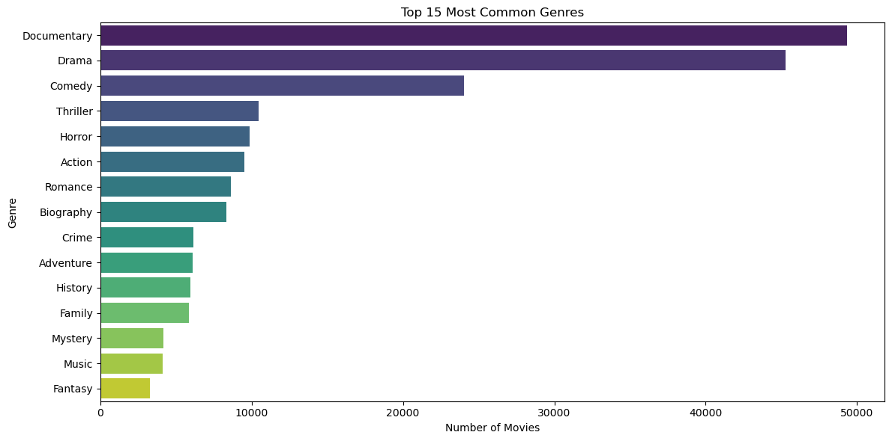

# Movie Insights Analysis


Welcome to the *Movie Insights Analysis* project! This project is part of the Flatiron Phase 2 Data Science curriculum and is aimed at uncovering strategic business insights from multiple movie industry datasets. The final goal is to assist studios and stakeholders in making data-driven decisions related to film production, budgeting, and release strategies.

---

## Table of Contents

- [Project Description](#project-description)
- [Datasets Used](#datasets-used)
- [Directory Structure](#directory-structure)
- [Installation & Setup](#installation--setup)
- [Exploratory Data Analysis (EDA)](#exploratory-data-analysis-eda)
- [Visualizations](#visualizations)
- [Insights](#insights)
- [Recommendations](#recommendations)
- [Conclusion & Business Value](#conclusion--business-value)
- [Team](#team)
- [License](#license)

---

## Project Description

This project merges, cleans, and analyzes movie data from diverse sources including IMDb, Rotten Tomatoes, The Numbers, TMDb, and Box Office Mojo. Through EDA, visualization, and statistical tests, it reveals patterns that drive revenue, audience reception, and market trends.

The ultimate goal is to guide studios in:
- Identifying profitable genres and budget ranges.
- Understanding relationships between critical ratings and audience popularity.
- Making smarter production and release decisions based on data.

---

## Datasets Used

All data files are located in the datasets/ folder:

| File Name | Source |
|----------|--------|
| bom.movie_gross.csv.gz | Box Office Mojo |
| tn.movie_budgets.csv.gz | The Numbers |
| tmdb.movies.csv.gz | TMDb |
| rt.movie_info.tsv.gz, rt.reviews.tsv.gz | Rotten Tomatoes |
| im.db (from im.db.zip) | IMDb SQLite DB |

> All sources were publicly available and used for educational purposes.

---

## Directory Structure

Movie-Insights-Analysis/
├── datasets/
│ ├── bom.movie_gross.csv.gz
│ ├── tn.movie_budgets.csv.gz
│ ├── tmdb.movies.csv.gz
│ ├── rt.movie_info.tsv.gz
│ ├── rt.reviews.tsv.gz
│ └── im.db.zip
├── notebooks/
│ └── movie_analysis_notebook.ipynb
├── images/
│ └── (Saved plots and figures)
├── README.md
└── .gitignore

## Installation & Setup

To run this project locally:

### 1. Clone the repo
```bash
git clone https://github.com/OndiekiFrank/Movie-Insights-Analysis.git
cd Movie-Insights-Analysis
```

### 2 Create a virtual environment
```bash
python -m venv venv
source venv/bin/activate  # On Windows use venv\Scripts\activate
```
### 3. Install dependencies
```bash
pip install -r requirements.txt
```

### 4. Unzip the IMDb database
```bash
cd datasets
unzip im.db.zip
```
### 5. Launch Jupyter Notebook
```bash
jupyter notebook .
```
## Exploratory Data Analysis (EDA)
**Key EDA findings include:**

- Wide variation in profitability across genres.

- Budget correlates positively with worldwide gross.

- High popularity doesn't always equate to high ratings or revenue.

- Most movies cluster in the $10M–$100M budget range.

## Visualizations
**We used matplotlib and seaborn for the following plots:**

- Revenue by Genre

- Budget vs Gross Revenue Scatter

- Popularity vs Rating Density

- Heatmap of Correlation Between Numeric Features

Visualizations are stored in the images/ directory and embedded in the notebook.



## Insights
- Budget Efficiency: Higher budgets often lead to higher gross but do not guarantee profitability.

- Genre Patterns: Action, Adventure, and Animation tend to dominate global box offices.

- Audience Ratings: Critical acclaim and audience popularity are not always aligned.

- Studio Strength: Some studios consistently outperform competitors in ROI and reach.
